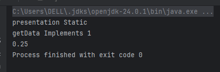
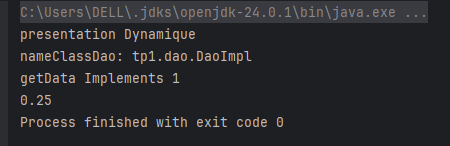

# TP1 - Injection de dépendances
**Réalisé par :** Ayyoub Ait mansour
**Filière :** SDIA


## 📚 Objectif

Implémenter différentes approches d’injection de dépendances :

* ✅ Injection manuelle (via le code Java)
* ✅ Injection dynamique via `Class.forName(...)` (lecture de `config.txt`)
* ✅ Injection via Spring XML (fichier `config.xml`)
* ✅ Injection via Spring annotations

---

## Structure du projet

```plaintext
src/
├── tp1/
│   ├── dao/
│   │   ├── IDao.java
│   │   └── DaoImpl.java
│   ├── Metier/
│   │   ├── IMetier.java
│   │   └── Metier.java
│   └── pres/
│       ├── PresStat.java            # Injection manuelle
│       ├── PresDynam.java           # Injection dynamique via Class.forName
│       ├── presSpringXml.java       # Injection via Spring XML
│       └── presSpringAnnotation.java # Injection via annotations Spring
└── src/main/resources/
    ├── config.txt                   # Classe DAO et Metier pour injection dynamique
    └── config.xml                   # Configuration Spring XML
└── img/
    ├── result-manual.png
    ├── result-dyn.png
    ├── result-xml.png
    └── result-anno.png
```

---

## 1. Injection manuelle

**Classe** : `PresStat.java`

```java
package tp1.pres;

import tp1.dao.DaoImpl;
import tp1.Metier.Metier;

public class PresStat {
    public static void main(String[] args) {
        System.out.println("presentation Static");
        DaoImpl dao = new DaoImpl();
        Metier metier = new Metier(dao);
        System.out.println(metier.clalcul());
    }
}
```

### Résultat



---

## 2. Injection dynamique via Class.forName

**Classe** : `PresDynam.java`

```java
package tp1.pres;

import tp1.dao.IDao;
import tp1.Metier.IMetier;
import java.io.File;
import java.util.Scanner;

public class PresDynam {
    public static void main(String[] args) throws Exception {
        System.out.println("presentation Dynamique");
        Scanner sc = new Scanner(new File("src/main/resources/config.txt"));
        String daoClass = sc.nextLine();
        IDao dao = (IDao) Class.forName(daoClass).newInstance();
        String metierClass = sc.nextLine();
        IMetier metier = (IMetier) Class.forName(metierClass)
                                  .getConstructor(IDao.class)
                                  .newInstance(dao);
        System.out.println(metier.clalcul());
    }
}
```

**Fichier** `config.txt` :

```plaintext
tp1.dao.DaoImpl
p17.Metier.Metier
```

### Résultat



---

## 3. Injection via Spring XML

**Configuration** : `src/main/resources/config.xml`

```xml
<?xml version="1.0" encoding="UTF-8"?>
<beans xmlns="http://www.springframework.org/schema/beans"
       xmlns:xsi="http://www.w3.org/2001/XMLSchema-instance"
       xsi:schemaLocation="http://www.springframework.org/schema/beans
       http://www.springframework.org/schema/beans/spring-beans.xsd">

    <bean id="d" class="tp1.dao.DaoImpl" />
    <bean id="metier" class="tp1.Metier.Metier">
        <property name="dao" ref="d" />
    </bean>
</beans>
```

**Classe** : `presSpringXml.java`

```java
package tp1.pres;

import org.springframework.context.ApplicationContext;
import org.springframework.context.support.ClassPathXmlApplicationContext;
import tp1.Metier.IMetier;

public class presSpringXml {
    public static void main(String[] args) {
        System.out.println("version XML");
        ApplicationContext context = new ClassPathXmlApplicationContext("config.xml");
        IMetier metier = context.getBean("metier", IMetier.class);
        System.out.println(metier.clalcul());
    }
}
```

### Résultat


---

## 4. Injection via Spring annotations

**Annotations** dans les classes :

```java
// Dans DaoImpl.java
@Component("d")
public class DaoImpl implements IDao { ... }

// Dans Metier.java
@Component("m")
public class Metier implements IMetier {
    @Autowired
    private IDao dao;
    ...
}
```

**Activation** (à ajouter dans `config.xml` ou un autre fichier XML) :

```xml
<context:component-scan base-package="tp1" />
<context:annotation-config />
```

**Classe** : `presSpringAnnotation.java`

```java
package tp1.pres;

import org.springframework.context.ApplicationContext;
import org.springframework.context.annotation.AnnotationConfigApplicationContext;
import tp1.Metier.IMetier;

public class presSpringAnnotation {
    public static void main(String[] args) {
        System.out.println("Annotation");
        ApplicationContext ctx =
            new AnnotationConfigApplicationContext("tp1");
        IMetier metier = ctx.getBean(IMetier.class);
        System.out.println(metier.clalcul());
    }
}
```

### Résultat


---
